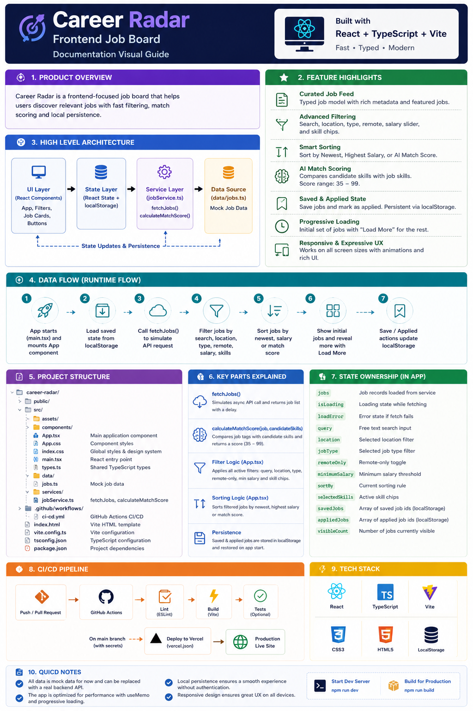

## Product Overview

Career Radar is a frontend-focused job board built with React + TypeScript. It combines fast filtering, match scoring, and local persistence to provide a focused job discovery experience.



## Feature List
### 1. Curated job feed

- Uses a typed job model with metadata for role, location, type, salary, experience, and skills.
- Renders featured jobs with higher visual prominence.

### 2. Advanced filtering

- Search by title, company, location, and skill terms.
- Filter by location and job type.
- Remote-only toggle.
- Minimum salary slider.
- Skill chips for targeted matching.
### 3. Smart sorting

- Sort by newest posting date.
- Sort by highest salary.
- Sort by AI match score.

### 4. AI match scoring

- Candidate profile skills are compared to each job's skills.
- Produces a score between 35 and 99 to prioritize relevant roles.
### 5. Saved and applied state

- Save jobs directly from cards.
- Mark jobs as applied with one click.
- Persists both states in localStorage for a smooth revisit experience.

### 6. Progressive loading

- Loads an initial subset of jobs and reveals more with a Load More action.
- Keeps the UI responsive and focused.

### 7. Responsive and expressive UX

- Works on desktop, tablet, and mobile breakpoints.
- Includes intentional typography, rich color direction, and subtle entrance animations.

# Architecture Decisions

## Why React + TypeScript + Vite

- React provides a fast way to build interactive UI with reusable patterns.
- TypeScript protects data model changes and prevents runtime bugs in filtering logic.
- Vite provides fast local development and lightweight static deployment.

## Layered Design

### Data model

- A strict Job interface keeps all job records consistent.
- SortBy and union types reduce invalid state values.
### Service layer

- fetchJobs simulates backend behavior with async calls.
- calculateMatchScore centralizes business logic so it can move to backend later without rewriting UI.
### Presentation layer

- App composes hero, filter controls, and job cards.
- Derived collections use useMemo to avoid expensive recomputation.
- UI state and persistence are intentionally separated from domain objects.
## State Management Choices

- Local component state is enough for this project size.

- localStorage persists saved and applied jobs without needing backend auth.

- Derived lists (filtered, sorted, paginated) are computed from a single source of truth.

## CI/CD Strategy

- Pull requests and pushes run lint + build.
- Main branch additionally deploys to Vercel when required secrets are available.
- Deployment uses Vercel CLI with prebuilt artifacts for predictable production output.

# Code Documentation

## Purpose

This document explains how the job board codebase is organized and how the main runtime flow works.
It is intentionally code-focused and complements the product notes in FEATURES.md and the design notes in ARCHITECTURE.md.

## Folder and File Map
### src/App.tsx

- Main React container for the application.
- Owns all UI state for filters, saved jobs, applied jobs, and visible job count.
- Loads jobs, filters them, sorts them, and renders the final job cards.

### src/App.css

- Component-level styles for the job board layout.
- Handles the hero section, filters, cards, buttons, responsive breakpoints, and animations.
### src/index.css

- Global style system.
- Declares shared color tokens, typography, page background, and base layout rules.
### src/types.ts

- Shared TypeScript types.
- Defines Job, JobType, ExperienceLevel, and SortBy.
### src/data/jobs.ts

- Mock data source used by the app.
- Contains the job list rendered in the UI.
### src/services/jobService.ts

- Service layer for asynchronous job fetching.
- Contains the AI-style match score calculation logic.

### .github/workflows/ci-cd.yml

- GitHub Actions workflow for linting, building, and Vercel deployment.
## Runtime Flow

1. The app starts in src/main.tsx and mounts App.
2. App loads saved state from localStorage.
3. App calls fetchJobs() to simulate a backend request.
4. The job list is filtered by search text, location, type, remote flag, salary, and skills.
5. The filtered list is sorted by newest, salary, or match score.
6. The first batch of jobs is shown and the rest are revealed with Load More.
7. Save and Applied actions update localStorage so the state persists across refreshes.

## Key Functions

### fetchJobs()

- Returns the job list with a simulated delay.
- Used to make the UI behave like it is reading from a backend API.
### calculateMatchScore(job, candidateSkills)

- Compares job tags against the candidate profile skills.
- Returns a normalized score used by the Best Match sort option.
### App filter logic

- Query matching checks title, company, location, and skills.
- Location and job type are exact-value filters.
- Remote-only and minimum salary are boolean and numeric constraints.
- Selected skill chips require at least one matching tag.
## State Ownership

App owns the UI state because the project is small enough that a global store is not needed.

State groups:

- jobs: loaded job records
- isLoading: fetch state
- loadError: error state
- query: free-text search
- location: selected location filter
- jobType: selected type filter
- remoteOnly: remote-only toggle
- minimumSalary: salary threshold slider
- sortBy: current sorting rule
- selectedSkills: active skill chips
- savedJobs: persisted saved job ids
- appliedJobs: persisted applied job ids
- visibleCount: number of cards shown before loading more
## Persistence Behavior

- savedJobs and appliedJobs are restored from localStorage on startup.
- Toggling either action immediately writes the new array back to localStorage.
- This keeps the app usable without a backend account system.
## Styling Notes

- Global typography comes from src/index.css.
- The page uses a warm editorial-style palette and Inter-based font stack.
- Card motion and hero animation are defined in src/App.css.
- Responsive behavior collapses the grid and filter layout on smaller screens.
## Build and Verification

```bash
npm install

npm run lint

npm run build

npm run dev
```

## Extension Points

- Replace src/data/jobs.ts with a real API response.
- Move filtering and search to a backend if the dataset grows.
- Add authentication to associate saved jobs with a user account.
- Add automated tests for filtering and sorting logic.
- Add pagination or infinite scroll once the dataset becomes larger.